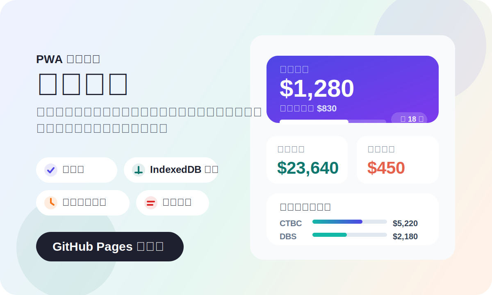

# 我的錢包 My Money



一個為個人日常花費設計的輕量記帳工具。開站就能看到今天還能花多少、目前錢包剩多少、這個月各張信用卡累積多少，沒有登入、沒有雲端依賴，資料直接存在裝置裡。

線上使用：[https://cainmaila.github.io/my-money/](https://cainmaila.github.io/my-money/)

## 這個工具適合誰

- 想快速記下每一筆開銷，不想被複雜報表綁住的人
- 平常以現金和多張信用卡混合消費，想同時看餘額與卡費的人
- 希望用目標日期倒推每日可用預算，控制花費節奏的人
- 想要離線可用、零註冊、零月費的個人記帳方案的人

## 你會先看到什麼

### 1. 今日可花

首頁直接顯示從今天到目標日期為止，每天大約還能花多少。已經花掉多少、今天還剩多少，也會用進度條立刻反映。

### 2. 錢包餘額

每筆支出會即時扣回目前餘額，不需要自己心算現金還剩多少。

### 3. 本月信用卡應付

支援 CTBC、E.SUN、Taishin、Fubon、DBS 五家銀行。刷卡消費會自動依銀行累計，月底對帳更直接。

## 核心功能

| 功能             | 說明                                               |
| ---------------- | -------------------------------------------------- |
| 快速記帳         | 輸入日期、明細、金額與付款方式即可儲存             |
| 現金與信用卡分流 | 現金支出影響餘額，信用卡支出同步累積每月應付       |
| 每日預算計算     | 設定未來目標日期後，自動算出剩餘天數與每日可花額度 |
| 歷史紀錄編修     | 已記錄的消費可直接在歷史頁修正                     |
| 每日紀錄複製     | 可一鍵複製某天的消費文字，方便貼到訊息或備忘錄     |
| 離線可用         | 首次載入後可透過 PWA 快取維持基本操作體驗          |

## 使用流程

1. 到設定頁加入目前可用資金。
2. 設定一個未來目標日期，例如發薪日或結帳日。
3. 每次消費後到記帳頁補上金額與付款方式。
4. 回到首頁看今天還能花多少。
5. 到歷史頁檢查每日紀錄，必要時直接修改。

## 產品特色

- 本機優先：資料存在瀏覽器 IndexedDB，不需後端服務
- 安裝友善：可加入主畫面，像 App 一樣使用
- 離線支援：已載入資源會由 Service Worker 快取
- 操作聚焦：只有總覽、記帳、紀錄、設定四個頁面，沒有多餘干擾

## 部署位置

GitHub Pages：<https://cainmaila.github.io/my-money/>

## 技術概覽

- SvelteKit
- Svelte 5
- TypeScript
- IndexedDB + Dexie
- Skeleton UI
- PWA Service Worker
- GitHub Pages

## 本機開發

```bash
pnpm install
pnpm dev
```

## 建置與檢查

```bash
pnpm check
pnpm test:unit -- --run
BASE_PATH=/my-money pnpm build
```
